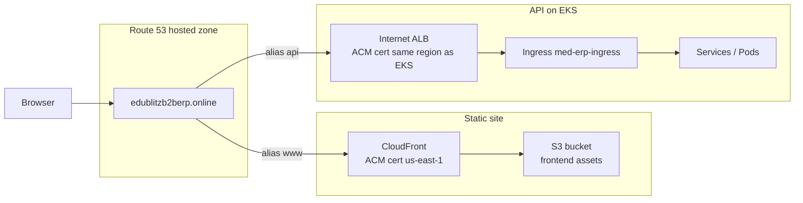

# Kubernetes / EKS Deployment Guide

---

## Prerequisites

- `kubectl` 1.28+
- `helm` 3.x
- AWS CLI configured with sufficient IAM permissions
- EKS cluster running (see TERRAFORM_DEPLOYMENT.md)
- Images pushed to ECR

---

## Reference architecture — **edublitzb2berp.online**

Traffic is split between a **static React app** (S3 + CloudFront) and **APIs** on **EKS** behind an **Application Load Balancer (ALB)** created by the **Kubernetes Ingress**.

| Hostname | AWS components | Purpose |
|----------|----------------|---------|
| **`www.edublitzb2berp.online`** (or apex `edublitzb2berp.online`) | **Route 53** → **CloudFront** → **S3** | React/Vite SPA (`frontend/dist`) |
| **`api.edublitzb2berp.online`** | **Route 53** → **ALB** (from **Ingress**) → **EKS Services / Pods** | Spring Boot microservices |



**Why two ACM certificates (typical setup)**  
- **CloudFront** can use an ACM certificate only if it is issued in **AWS region `us-east-1`** (N. Virginia), even if your bucket or users are elsewhere.  
- The **ALB** that terminates HTTPS for the API must use an ACM certificate in the **same AWS region as the load balancer** (the region where your **EKS cluster** runs, e.g. `ap-southeast-2`).

Suggested DNS records (in the **Route 53** hosted zone for `edublitzb2berp.online`):

| Record | Type | Target |
|--------|------|--------|
| `www.edublitzb2berp.online` | **A** (and optional **AAAA**) **alias** | Your **CloudFront distribution** domain |
| `api.edublitzb2berp.online` | **A** **alias** | The **ALB** DNS name shown on `kubectl get ingress -n med-erp` (**ADDRESS** column) |

After you apply `k8s/ingress/ingress.yaml`, set **`spec.rules[0].host`** to `api.edublitzb2berp.online` and set the Ingress annotation **`alb.ingress.kubernetes.io/certificate-arn`** to the **regional** ACM ARN for `api.edublitzb2berp.online`.

---

## SSL / TLS with **AWS Certificate Manager (ACM)**

1. **Certificate for CloudFront** (`www.edublitzb2berp.online` and/or `edublitzb2berp.online`)  
   - In **ACM console → region `us-east-1`**: **Request** a public certificate.  
   - Add names, e.g. `edublitzb2berp.online`, `www.edublitzb2berp.online`.  
   - **DNS validation**: create the **CNAME** records ACM shows you in **Route 53** (button **Create records in Route 53** if available).  
   - Wait until status is **Issued**. Copy the **certificate ARN** (must stay in **`us-east-1`**).  
   - Attach this ARN in the **CloudFront** distribution → **Custom SSL certificate** (see Terraform `s3-cloudfront` module or console).

2. **Certificate for the API ALB** (`api.edublitzb2berp.online`)  
   - In **ACM → same region as EKS/ALB** (e.g. `ap-southeast-2`): **Request** a public certificate for `api.edublitzb2berp.online`.  
   - **DNS validate** in Route 53.  
   - Put the **ARN** in `k8s/ingress/ingress.yaml`:

```yaml
alb.ingress.kubernetes.io/certificate-arn: arn:aws:acm:REGION:ACCOUNT:certificate/UUID
```

   **Important:** A **`us-east-1`** ACM ARN on the Ingress causes  
   `ValidationError: Certificate ARN 'arn:aws:acm:us-east-1:...' is not valid`  
   — regional **ALBs** must use a cert in the **same region** as the ALB (e.g. `ap-southeast-2`). **`us-east-1`** certs are for **CloudFront** only.

   - Set **`spec.rules[*].host`** to `api.edublitzb2berp.online`, then `kubectl apply -f k8s/ingress/`.

3. **Security group** on the ALB (annotation `alb.ingress.kubernetes.io/security-groups`) must allow **443** (and **80** if you redirect HTTP→HTTPS).

---

## Deploy the **frontend** to **Amazon S3** (with CloudFront)

The SPA is built with Vite; production calls the API at **`https://api.edublitzb2berp.online`** (same origin path patterns as in dev: `/api/user`, etc., if you put the ALB behind that host, or use full `VITE_*` URLs — match what you configure in `frontend` env).

### 1. Create the S3 bucket (if not using Terraform)

- Bucket name: e.g. `edublitzb2berp-frontend` (globally unique).  
- **Block Public Access**: keep **on** if you only serve via **CloudFront** (recommended) with an **Origin Access Control (OAC)** so only CloudFront reads the bucket.

### 2. Build the app with production API URLs

From repo root:

```bash
cd frontend

export VITE_USER_SERVICE_URL="https://api.edublitzb2berp.online/api/v1"
export VITE_PRODUCT_SERVICE_URL="https://api.edublitzb2berp.online/api/v1"
export VITE_ORDER_SERVICE_URL="https://api.edublitzb2berp.online/api/v1"

npm ci
npm run build
```

This writes static files to **`frontend/dist/`**.

### 3. Upload to S3

```bash
BUCKET="edublitzb2berp-frontend"
REGION="ap-southeast-2"   # bucket region (use yours)

aws s3 sync dist/ "s3://${BUCKET}/" --region "$REGION" --delete \
  --cache-control "public,max-age=31536000,immutable" \
  --exclude "*.html"

aws s3 cp dist/index.html "s3://${BUCKET}/index.html" \
  --region "$REGION" \
  --cache-control "no-cache,no-store,must-revalidate" \
  --content-type "text/html"
```

*(HashRouter `#/...` routes do not require S3 website error-document hacks for client-side routing.)*

### 4. CloudFront

- **Origin**: S3 with **OAC** (not legacy OAI unless you already use it).  
- **Default root object**: `index.html`.  
- **Alternate domain names (CNAMEs)**: `www.edublitzb2berp.online`, optionally apex.  
- **Custom SSL**: ACM certificate in **`us-east-1`** (see above).  
- After deploy, create a **Route 53 alias** from `www` (and apex if needed) to this distribution.

### 5. Invalidate cache after each release

```bash
aws cloudfront create-invalidation \
  --distribution-id YOUR_DISTRIBUTION_ID \
  --paths "/*"
```

For automation, see `jenkins/Jenkinsfile.frontend`. Infrastructure as code: `terraform/modules/s3-cloudfront` and Route 53 in this repo’s Terraform layout (`docs/TERRAFORM_DEPLOYMENT.md`).

---

## Step 1 — Configure kubectl

```bash
aws eks update-kubeconfig \
  --region us-east-1 \
  --name med-erp-prod-eks

# Verify connection
kubectl get nodes
```

---

## Step 2 — Install AWS Load Balancer Controller

```bash
# Add Helm repo
helm repo add eks https://aws.github.io/eks-charts
helm repo update

# Install ALB controller (uses IRSA)
helm install aws-load-balancer-controller eks/aws-load-balancer-controller \
  -n kube-system \
  --set clusterName=med-erp-prod-eks \
  --set serviceAccount.create=true \
  --set serviceAccount.annotations."eks\.amazonaws\.com/role-arn"=arn:aws:iam::ACCOUNT_ID:role/AWSLoadBalancerControllerIAMRole

# Verify
kubectl get pods -n kube-system -l app.kubernetes.io/name=aws-load-balancer-controller
kubectl get ingressclass
```

---

## Step 3 — Update Image References

Edit the deployment YAMLs to point to your ECR registry:
```bash
ECR_REGISTRY="123456789012.dkr.ecr.us-east-1.amazonaws.com"
IMAGE_TAG="v1.0.0"

# Replace placeholder in all deployment files
find k8s/deployments/ -name "*.yaml" -exec \
  sed -i "s|YOUR_ECR_REGISTRY|$ECR_REGISTRY|g; s|:latest|:$IMAGE_TAG|g" {} \;
```

---

## Step 4 — Namespace, then Secrets

Kubernetes will error with **namespace not found** if you create a `Secret` in `med-erp` before the namespace exists.

```bash
# Always apply this first
kubectl apply -f k8s/namespace/

kubectl get ns med-erp   # should show Active
```

**Never commit real secrets to Git.** Create the secret **after** the namespace exists:

```bash
kubectl create secret generic app-secrets \
  -n med-erp \
  --from-literal=MONGODB_URI_USER="mongodb+srv://..." \
  --from-literal=MONGODB_URI_PRODUCT="mongodb+srv://..." \
  --from-literal=MONGODB_URI_ORDER="mongodb+srv://..." \
  --from-literal=JWT_SECRET="your-256-bit-hex-secret" \
  --dry-run=client -o yaml | kubectl apply -f -
```

(Optional) If you use `k8s/secrets/app-secrets.yaml`, apply it **only after** `k8s/namespace/` and replace placeholder values — prefer `kubectl create secret` above for production.

---

## Step 5 — Apply All Manifests

```bash
# Create namespace first
kubectl apply -f k8s/namespace/

# ConfigMaps (no secrets here)
kubectl apply -f k8s/configmaps/

# Deployments and Services
kubectl apply -f k8s/deployments/
kubectl apply -f k8s/services/

# Horizontal Pod Autoscalers
kubectl apply -f k8s/hpa/

# AWS ALB Ingress — update certificate ARN and SG first
# Edit k8s/ingress/ingress.yaml:
#   alb.ingress.kubernetes.io/certificate-arn: arn:aws:acm:...
#   alb.ingress.kubernetes.io/security-groups: sg-...
# Applies IngressClass "alb" + Ingress (spec.ingressClassName: alb)
kubectl apply -f k8s/ingress/
```

---

## Step 6 — Verify Deployment

```bash
# Check pod status (all should be Running)
kubectl get pods -n med-erp

# Check services
kubectl get svc -n med-erp

# Get ALB DNS name
kubectl get ingress -n med-erp
# Note the ADDRESS — use it for Route53 CNAME

# Watch rollout
kubectl rollout status deployment/user-service -n med-erp
kubectl rollout status deployment/product-service -n med-erp
kubectl rollout status deployment/order-service -n med-erp
```

---

## Useful kubectl Commands

```bash
# View logs
kubectl logs -f deployment/user-service -n med-erp --tail=100

# Scale manually
kubectl scale deployment/product-service --replicas=3 -n med-erp

# Rolling restart
kubectl rollout restart deployment/order-service -n med-erp

# Exec into a pod
kubectl exec -it $(kubectl get pods -n med-erp -l app=user-service -o name | head -1) \
  -n med-erp -- sh

# View HPA status
kubectl get hpa -n med-erp

# Describe ingress (shows ALB events)
kubectl describe ingress med-erp-ingress -n med-erp
```

---

## Rolling Update (New Image)

```bash
# Update image in a running deployment
kubectl set image deployment/user-service \
  user-service=123456789012.dkr.ecr.us-east-1.amazonaws.com/med-erp/user-service:v1.1.0 \
  -n med-erp

# Watch rollout
kubectl rollout status deployment/user-service -n med-erp

# Rollback if needed
kubectl rollout undo deployment/user-service -n med-erp
```

---

## Troubleshooting

| Issue                          | Debug Command                                     |
|--------------------------------|---------------------------------------------------|
| Pod in CrashLoopBackOff        | `kubectl logs <pod> -n med-erp --previous`        |
| Pod in Pending                 | `kubectl describe pod <pod> -n med-erp`           |
| **Ingress / ALB: `Certificate ARN ... is not valid` (400)** | ALB requires an ACM cert in the **same region** as the load balancer (e.g. **`ap-southeast-2`**). A cert in **`us-east-1`** is only valid for **CloudFront** — request a separate **`api.…`** cert in the EKS region and use that ARN on the Ingress. |
| Ingress has no ADDRESS         | Check ALB controller logs in kube-system ns       |
| **Error: namespace "med-erp" not found** (secrets / apply) | Run **`kubectl apply -f k8s/namespace/`** before secrets or workloads |
| Pod **0/1 Ready**, app logs look healthy | Readiness uses `/actuator/health/readiness` — ensure services enable **`management.endpoint.health.probes.enabled=true`** and permit **`/actuator/health/**`** in security (fixed in repo); rebuild images and rollout |
| Service not reachable          | Check `kubectl describe svc <svc> -n med-erp`     |
| Secret missing                 | `kubectl get secret app-secrets -n med-erp`       |
